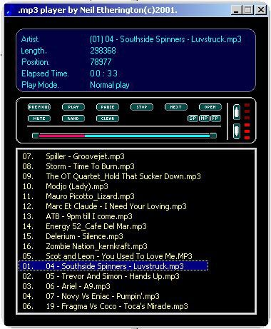



## An mp3 Player

### Description

This mp3 player is a little different to the mp3 players i`ve seen on this site

because it uses no media controls to play the files. It only uses the MCI commands.

Operations, 1.Play 2.Pause 3.Stop 4.Previous 5.Next 6.Mute 7.Random Select

8.Clear FileList 9.Volume Control 10.Slow Play 11.Normal Play 12.Fast Play and a

nice progress indicator. It also contains an Explorer Tree that i wrote to browse for

Files. INFO REQUIRED. can someone show me what information i need to add to

a C++ dll for me to access it from VB. eg. I`ve wrote a C++ dll with a simple

function in it, but when i try and access it from VB it tells me that it can`t find an

entry point, i think it said. Just recieved an e.mail stating that if the Computer name is

numeric my Explorer Tree causes a run time error, thanks for the feedback jason. The Explorer

Tree in this App uses the same Explorer Tree that i uploaded about a month ago.

Thought Microsoft fixed TreeView in new service pack but abviously not. I`ll fix it ltr.
 
### More Info
 
Music (Wow)

             |
---                |---
**Submitted On**   |2001-05-10 21:47:14
**By**             |[Nelly](https://github.com/Planet-Source-Code/PSCIndex/blob/master/ByAuthor/nelly.md)
**Level**          |Intermediate
**User Rating**    |4.5 (90 globes from 20 users)
**Compatibility**  |VB 6\.0
**Category**       |[Complete Applications](https://github.com/Planet-Source-Code/PSCIndex/blob/master/ByCategory/complete-applications__1-27.md)
**World**          |[Visual Basic](https://github.com/Planet-Source-Code/PSCIndex/blob/master/ByWorld/visual-basic.md)
**Archive File**   |[An mp3 Pla195885132001\.zip](https://github.com/Planet-Source-Code/nelly-an-mp3-player__1-23163/archive/master.zip)

### API Declarations

MCI Commands and a few for Explorer Tree.

